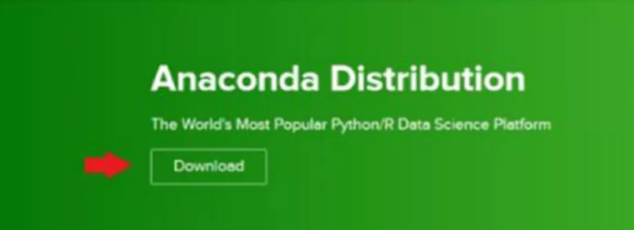
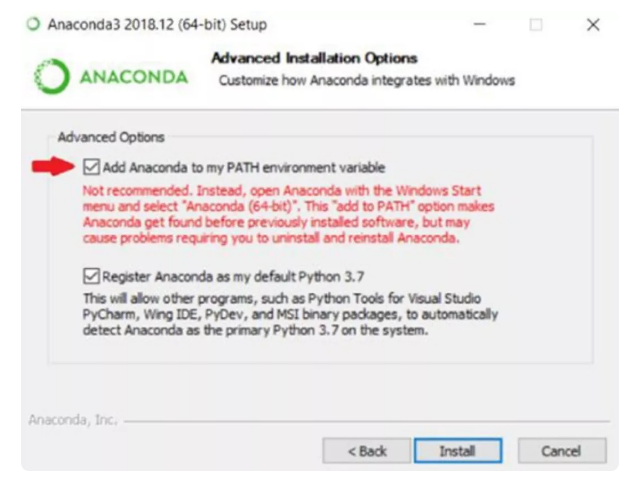
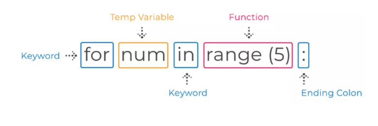
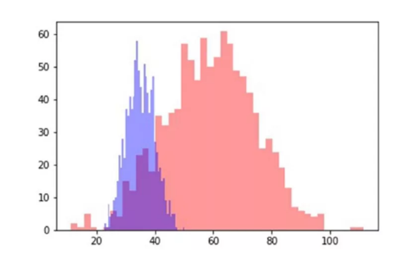

# Python-Projects-for-Beginners-Chinese-Version
《Python Projects for Beginners》中文版本

翻译小组成员：无尘-第一章；vally-第二章；II-第三章；南极物语-第四章；山中麻辣烫-第五章；淇天大圣-第六章；xiaole-第七章；

纯零基础，花10周时间，完全搞定Python，有没有可能？

今天我推荐大家一本书：《面向零基础的Python小项目》，如果你集中精力，花10周，也就是两个半月时间，搞定Python，真的不再是一句空谈了！

这本书从介绍什么是Python开始，然后告诉读者，如何安装anaconda：

以及如何设置设置环境变量等，类似这些问题看似不难，但的确很容易束缚住小白前进的脚步：

关于搭建环境部分，介绍的很详细。接着介绍如何使用终端，包括如何使用Python Shell，Jupyter Notebook等，一天学一个小工具，在周五时学习第一个小项目：猜数字游戏。这样第一周学完环境搭建和熟悉常用IDE，这种安排非常符合零基础的小白。

第二周，学习Python基础，这周一学习注释和基本的数据类型，周二学习变量，周三学习字符串，周四学习字符串的基础操作，周五做一个小项目：**创建饭店的消费小票**：

第三周，学习用户输入和条件表达式，又划分为五天，周五又是一个小项目：**创建一个计算器**。

第四周，介绍列表和循环，每天的介绍又拆分为若干小的知识点，周五又是一个小项目：

第五周，函数，分别讨论什么是函数，常见参数，返回语句，作用域，周五是**创建购物卡**的小项目。

接下来，第六周介绍了数据容器和文件，第七周介绍了面向对象编程，这周的小项目很有意思：**创建扑克牌**。

通过七周时间，讲完Python基础，每天学习任务过渡自然，小白学起来会很香！

接下来，第八周的标题：高效性，分别探讨了**列表表达式**、**lambda表达式**、**Map**、**Filter**和**Reduce**，**递归函数**，**二分搜索**，这些带有一些进阶的知识，这个布局真的太赞！

作者把第九周概括为复杂性，分别讨论**生成器**、**迭代器**、**装饰器**、**模块**，算法复杂度，以及**面试常见技术问题**和注意事项，作者的这个布局，以及用心程度，全都满分！

第十周是关于数据分析入门，作者先后讨论了**pip安装**第三方包及相关注意事项，**Pandas使用**，**数据可视化**，**网络爬虫**，非常圆满！

