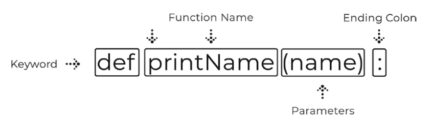
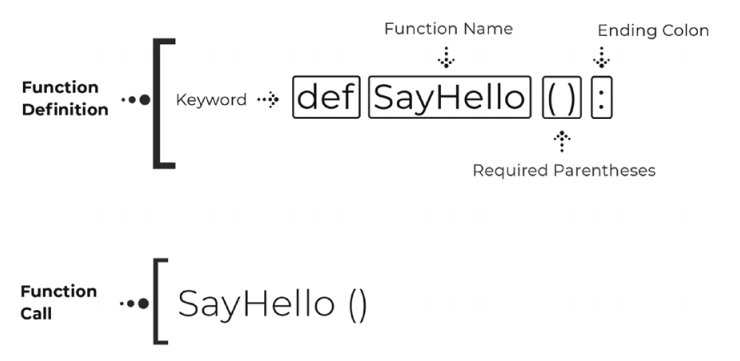

## 函数

本周开始函数主题，与循环相比，函数是一个相对难以理解的话题，因此本周将一直持续函数这个话题。这也是编程中比较重要的话题之一。了解如何使用函数会大大提高我们编程的水平。

函数能够使我们的代码更加强大和简洁同时也能节省我们的时间。虽然我们会在第一天讨论他们的工作原理，但我们使用函数的原因是函数具有一次编写和多次复用的特性。

许多我们之前已经编写的程序都受益于函数的使用，尤其是像Hangman这样的游戏。在这周结束时，我们会编写一个类似于购物车的项目。我们将看到为什么把任务分开是很重要的，比如把添加、删除和展示划分到单独的函数中。

本章概览

+ 如何使用函数以及它们是什么

+ 使用参数传递数据

+ 从函数返回数据

+ 理解作用域及其重要性

+ 创建一个购物车程序

<center>问题挑战</center>

记住，一个算法只不过是一组一步一步的指令的集合。如果我们要写一个换灯泡的算法，它会是什么样子?哪些问题是你必须考虑的?需要多少步骤?最有效的方法是什么?使用下面的算法，可能会出现什么问题?

1. 找一个备用灯泡。

2. 关闭电源开关。

3. 拧下当前灯泡。

4. 换上备用灯泡。

5. 打开新灯泡的电源开关。

6. 如果备用灯泡没有打开，重复步骤1到5。

### 星期一:创建和调用函数

今天的课程是关于理解什么是函数，函数的各个阶段，以及如何编写函数。我们会发现为什么函数在程序中如此重要以及函数如何使我们的编程体验更美好。

为了跟进今天的内容，让我们从“python_bootcamp”文件夹打开我们Jupyter Notebook。打开后，创建一个新文件，并将其重命名为“Week_05”。接下来，创建一个markdown的单元格名为“创建&调用函数”。我们将在这个单元格中写代码。

#### 什么是函数？

w3schools是编程最好的学习资料之一，那里甚至有python的教程。他们的官方文档是这么描述函数的：

函数是一段代码，它只在被调用时才会运行。

您可以将数据(称为参数)传递到函数中。

函数可以返回数据作为结果。

程序经常需要重复运行相同的代码，尽管循环有助于这一点，但我们不希望在整个程序中多次编写相同的循环。这个问题的解决方案是使用一个函数。函数的代码只会在调用时运行。

所有的函数通常都与一个任务或过程相关联。这使得我们更容易将程序拆分为函数。如果你构建一个需要重复打印5行信息的程序，并且需要在5个不同的地方输出它，那么需要编写25行代码。使用一个函数，你可以将这5行代码存储在一个块中，并在需要时调用该函数，结果是5行用于输出信息，5行用于调用函数，总共有10行代码。这会是一个更高效的程序。

#### 函数语法

与循环一样，函数的创建的遵循固定的结构。它们都以关键字“def”开头，后面跟着函数名。这个名称是除了Python关键字和先前定义的函数之外的任何名称。函数名后面是圆括号，这些括号内是参数。我们将在明天讨论参数，所以只需知道参数是可选的，但括号是必需的。最后，我们需要一个像其他Python语句一样的结束冒号。示例见图5-1



<center>图5-1</center>

#### 编写你的第一个函数

现在我们知道了语法结构是什么样的了，让我们来写我们自己的函数:

``` python
# 编写你的第一个函数
def printInfo():# 定义一个函数
    print("Name: John Smith")
    print("Age: 45")
printInfo( ) # 调用函数
printInfo( ) # 再次调用函数
```

继续并运行单元格。我们定义了一个名为printInfo的函数，它在每次被调用时打印两行信息。下面我们调用函数两次，它输出信息两次。这看起来似乎没什么卵用，但如果你需要在一个程序中输出20次信息，那么它是非常简洁和高效的。

#### 函数的阶段

在Python中，每个函数有两个阶段。第一阶段是函数定义。这个阶段定义函数的名称，它应该接受的任何参数，以及它应该在与之关联的代码块中做什么。见图5-2。



<center>图5-2</center>

第二个阶段称为函数调用。函数在被调用之前永远不会运行，因此你可以定义任意多个函数，如果你从未调用其中一个函数，就不会发生任何事情。当你调用一个函数时，它会运行函数定义中的代码。

#### 用户自定义函数VS内置函数

在不知不觉中，你一直在用函数。诸如range、print、len等函数都被称为“内置”函数。之所以包含在python中，是因为它们具有帮助构建应用程序的特定用途。现在我们正在学习函数，我们可以开始创建我们自己的“用户自定义函数”。

#### 实现一个计算器

让我们再看一个基本函数的例子，但这次不仅仅在函数内部打印信息:

``` python
# 在函数内执行计算
def calc( ):
    x, y = 5, 10
    print(x + y)
calc( ) # 将会运行计算代码并输出15
```

继续并运行单元格。每次调用calc函数，我们都会得到一个15的输出。

<center>周一练习</center>

1. myName：定义一个myName函数，调用时让其打印你的名字
2. pizzaToppings：定义一个 pizzaToppings函数，打印出所有你喜欢的披萨配料，并且调用其三次

虽然今天没有写太多的代码，但是理解函数的价值是对我们来说是至关重要的。现在我们可以将代码拆分为函数块，这会使得程序更加容易阅读和运行。