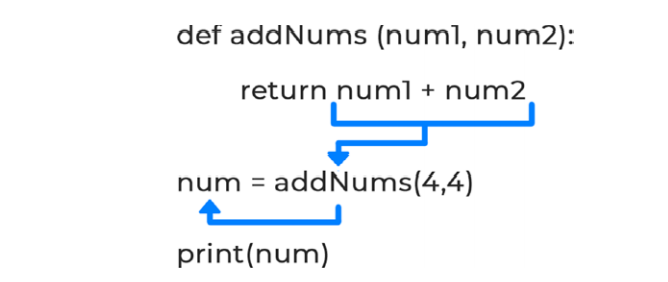

### 周三：返回值

到目前为止，我们已经可以打印出经函数更改的数据，但是如果以后需要访问这些信息，该怎么做？这就是使用return语句的地方。函数可以操作数据，然后将其发送回函数调用的位置，以保存信息以供以后使用。今天我们将学习如何做到这一点，以及为什么它是有用的。

为了完成这节课，我们继续打开“Week_05”文件并在底部添加一个名为“ 返回值”的markdown单元格。

#### 它是怎么工作的

图5 - 4展示了两个参数被传入一个函数，在这个函数中先运算然后返回结果到调用位置并且被赋值给了一个变量。这个变量现在可以在后面的程序中被继续使用。



图 5-4. 返回信息并存到一个变量中

你可以返回任何数据类型但可能只返回单个变量。当你需要返回一个以上的数据时，你会返回的是一个数据集合:

``` python
>>> def returnMultiple():
>>>     a=5
>>>     b=10
>>>     return [a,b] #一个包含多个数据条目的类型
```

#### 使用Return

return语句被用于将信息发送回函数被调用的地方。到目前为止，我们使用了print语句来输出信息，但是如果我们需要在程序的后面访问那个值，这就不起作用了。相反，我们可以返回值并将其保存到一个以后可以使用的变量中。让我们看几个例子：

``` python
# 使用return关键字来返回两数之和
def addNums(num1, num2):
    return num1 + num2
num = addNums(5.5, 4.5) # 把函数返回值保存在num中
print(num)
print(addNums(10, 10)) # 不保存函数的返回值
```

#### 三元运算符

三元运算符是Python分支语句的简写。这些运算符可以用来给变量赋值，或者在这种情况下例如决定函数返回什么：

``` python
# 使用三元运算符简化语法
def searchList(aList, el):
    return True if el in aList else False
result = searchList(["one", 2, "three"], 2) # result = True
print(result)
```

继续并运行单元格。三元运算符返回True，因为满足给定的条件。不使用三元运算符的情况下通常写出的代码如下所示:

``` python
>>> if el in aList:
>>>     return True
>>> else:
>>>     return False
```

如果可以，尽量少写代码通常是一个好习惯，但这不是必须的。

<center>周三练习</center>

1. Full Name:创建一个函数，该函数接受姓和名，并将这两个名字连接在一起返回。
2. User Input:在函数中，请求用户输入。让这个函数返回输入的内容并存储在函数外部的变量中。然后打印这个输入内容。