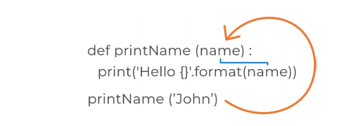

### 周二：参数

我们使用函数的主要原因之一是可以让我们的代码变得模块化。今天的内容都是关于如何在函数中使用参数以及参数是什么。

为了跟上这节课的进度，让我们从之前的notebook文件“Week_05”开始，在底部添加一个新的Markdown单元格命名为"参数"。

#### 什么是参数？

参数是在函数定义中声明的临时变量。虽然到目前为止我们所写的函数执行的是一个特定的任务，但它们不是模块化的，因为它们对每个调用总是打印出相同的响应信息。当你想要调用含有不同值的函数时，你需要使用参数。在函数定义的圆括号中可以声明参数名。这是可以是一个任意的变量名，在函数体内使用这个变量，但是通常情况下需要与你正在使用的数据相关。在调用该函数时，传入运行代码块所需的值。如图5 - 3



<center>图5-3</center>

**注意**:参数是被传递到函数调用中的值。在图5-3中，第3行将参数“John”传递给printName函数，该值将被传递给参数名

函数在括号内定义了一个名为“name”的参数。同样，这可以起一个其他的名字，但是我们希望传递一个人的名字。该代码块在执行时将在print语句中使用该参数的值。在第3行调用中，我们将值传递给函数，称为参数。在本例中，我们将得到“Hello John”的输出。我们现在可以调用这个函数并传入任何我们想要的字符串值，它会打印出来。这个函数现在是模块化的。

#### 传入单个参数

让我们用图5-3中的例子来创建第一个接收参数的函数例子

``` python
# 传单个参数到函数中
def printName(full_name):
    print( "Your name is: { }".format(full_name) )
printName("John Smith")
printName("Amanda")
```

继续并运行单元格。运行相同的函数，我们将得到两个不同的输出。参数允许我们为每次调用传递不同的信息。

#### 多个参数

前面的示例将字符串类型传递到函数中，让我们看看如何传入数字类型并创建一个格式优美的print语句：

``` python
# passing multiple parameters into a function
def addNums(num1, num2):
    result = num1 + num2
	print( "{ } + { } = { }".format(num1, num2, result) )
addNums(5, 8) # 输出 13
addNums(3.5, 5.5) # 输出 9.0
```

继续并运行单元格。我们的函数期望传入两个数字参数num1和num2。在函数内部，我们引用了通过参数名传入的值。

#### 传递一个列表

传递大量数据通常利用列表是最容易的。函数非常擅长利用列表执行重复任务。我们来看一个例子：

``` python
# 用函数计算数字的平方
numbers1 = [ 2, 4, 5, 10 ]
numbers2 = [ 1, 3, 6 ]
def squares(nums):
	for num in nums:
		print(num**2)
squares(numbers1)
squares(numbers2)
```

继续并运行单元格。可以看到，它会输出所有数字的平方。这比为每个列表编写两次for循环要高效得多。这就是函数和传递参数的美妙之处。

**注意**，nums是一个任意参数名，它是我们在函数中引用的变量。

#### 默认参数

在许多情况下，参数可以与默认值相关联。以pi的值为例;它总是3.14，所以我们可以设置一个叫做pi的参数为这个精确值。这允许我们调用已经定义了值的函数。如果你想要一个更简洁的pi值，你可以传入其他值，但通常3.14已经足够好了:

``` python
# 设置默认参数的值
def calcArea(r, pi=3.14):
	area = pi * (r**2)
	print( "Area: { }".format(area) )
calcArea(2) # 假设半径为2
```

继续并运行单元格。现在我们可以运行这个函数而不需要给pi传值。函数的默认参数必须始终在非默认参数之后。在这个例子中，半径必须先声明，然后才是pi。

#### 可选参数

有时你需要使函数具有可选参数。最好的例子是中间名字如John**·**Smith**·**Paul中的Smith;有些人有，有些人没有。如果我们想写一个函数，可以正确打印出两种情况，我们将需要使中间名称一个可选参数。我们通过指定一个空字符串值作为默认值来实现:

``` python
# 设置默认参数值
def printName(first, last, middle=""):
	if middle:
		print("{} {} {}".format(first, middle, last))
	else:
		print("{} {}".format(first, last))
printName("John", "Smith")
printName("John", "Smith", "Paul") # 将会输出中间名字
```

继续并运行单元格。无论你是否传递middle，函数都将以两种方式高效运行。请记住参数的顺序！参数必须按照函数定义从左到右对齐。如果在第二次调用中，“Paul”被放置在第二个参数，那么我们的函数将把“Paul”分配到参数“last”中。

#### 显式参数赋值

在函数调用中，可以明确地为参数赋值。当你不想混淆传入值的顺序时，这是有用的，因为默认情况下它们是从左到右工作的。如果愿意，可以使用参数名为每个参数赋值，但大多数情况下没有必要这样做。让我们来看一个例子:

``` python
# 通过引用名称显式地为参数赋值
def addNums(num1, num2):
    print(num2)
    print(num1)
addNums(5, num2 = 2.5)
```

继续并运行单元格。在这里，我们使用关键字参数显式地在调用中分配num2的值。

#### *args

使用 \*args 可以向函数传递数量可变的参数。这允许你使函数更加模块化。魔力不是这里的“args”关键字;而是一元运算符 *允许我们执行这个特性。理论上，你可以把 args 替换成任何一个词，比如 “data”，它仍然可以工作。然而，args 是整个行业的默认和通用标准。让我们看看如何在函数调用中使用 args:

``` python
# 使用args参数接受含任意值的元组
def outputData(name, *args):
    print(type(args))
	for arg in args:
		print(arg)
outputData("John Smith", 5, True, "Jess")
```

继续并运行单元格。你将注意到，args参数将调用中未分配的所有值作为元组，作为第一个print语句的输出。然后输出该元组中的每个参数。当你访问args参数时，你不需要包含一元运算符\*。注意，没有打印出“John Smith”。这是因为函数定义中有两个参数，name和*args。函数调用中的第一个参数映射到name参数，其余参数插入到args元组中。当你不确定需要多少个参数时，这是一个有用的机制。

#### **kwargs

与args一样，kwargs允许我们在函数中接受任意数量的值。但是它把多个关键字参数打包成字典。关键字参数的值是带键传入的值，这允许我们在函数中轻松地访问它们。这里的神奇之处在于这两个一元运算符(**)，而不是kwargs的关键字。让我们来看看:

``` python
# 使用kwargs参数接受任意值的字典
def outputData(**kwargs):
    print(type(kwargs))
    print(kwargs["name"])
    print(kwargs["num"])
outputData(name = "John Smith", num = 5, b = True)
```

继续并运行单元格。这一次，我们可以看到类型是一个字典，并且我们能够输出kwargs参数中所有的键-值对，就像我们输出任何其他字典一样。此单元格内的关键字参数在函数调用中，我们在其中明确声明要传递到函数中的键和值。

<center>周二练习</center>

1. 用户输入：要求用户输入一个词，并且把这个词传入函数来检查是否是大写字母开头，是则返回True，否则返回False
2. No name：定义一个接受两个参数first_name和last_name的函数，并使这两个参数都是可选的。如果没有传入参数值，则输出“No name passed in”;否则，它应该打印出name。

今天讲的是函数参数以及如何使用它们。参数的使用使程序中的函数更加模块化，让我们的代码行数大大地减少。