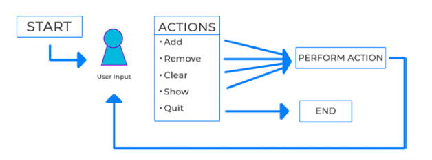

### 周五：构建一个购物车程序

对于今天的项目，我们将构建一个在列表中存储产品的应用程序。我们将能够添加、删除、清除和显示购物车中的产品。会使用到过去几周讲到的所有概念。

要继续学习这一课，让我们继续前面的notebook文件“Week_05”，并在底部添加一个markdown单元格，该单元格命名为“周五项目:创建购物车”。

#### 最终设计

正如我们在本周介绍的函数一样，最终的设计将基于程序动作的逻辑。函数执行特定的任务，这通常是一个动作。对于我们的购物车程序，我们需要考虑的操作是添加、删除、清除和显示购物车中的项目的任务。逻辑设计如图5-5所示。



<center>图5-5 购物车程序逻辑图</center>

我们将确保有一个main函数，它将包含循环和处理用户输入部分。

#### 初始化设置

与上周的项目一样，我们将在单个单元格中创建程序，因此请确保你熟悉我们在该项目中使用的相关概念。首先，让我们在Jupyter Notebook中导入clear_output函数，并声明一个全局变量:

``` python
1| # 导入必要的函数
2| from IPython.display import clear_output
4| # 全局列表变量
5| cart = [ ]
```


我们想声明一个cart的全局变量，以便在整个程序中使用。我们将使用一个列表，因为我们需要存储几个项目。使用列表还允许我们直接编辑变量，而不需要为了赋值将其传递。

#### 增加项目

正如在最初的设计中所述，我们将首先创建我们的函数。我们将从添加商品到购物车cart变量的函数开始:

```python
 7| # 创建添加项目到购物车的函数
 8| def addItem(item):
 9|     clear_output()
10|     cart.append(item)
11|     print("{ } has been added.".format(item))
```

在创建主循环之前，我们不会调用这个函数。当调用该函数时，该函数将清除输出，将传递的项目附加到参数中，并输出给用户。

#### 删除项目

接下来，我们将创建一个函数，从购物车变量中删除商品:

``` python
13| # 创建从购物车删除商品的函数
14| def removeItem(item):
15|     clear_output()
16|     try:
17|         cart.remove(item)
18|         print( "{ } has been removed.".format(item) )
19|     except:
20|         print("Sorry we could not remove that item.")
```

我们希望确保在remove语句周围包含一个try和except子句，因为当删除一个不存在的项目时，程序会崩溃。这将防止这种情况发生，并将正确地删除商品项目或着向用户输出删除失败的信息。

#### 显示购物车

我们希望用户能够在任何时候查看购物车，这使用了一个简单的循环:

``` python
22| # 创建一个显示购物车商品的函数
23| def showCart():
24|     clear_output()
25|     if cart:
26|         print("Here is your cart:")
27|         for item in cart:
28|             print( "- { }".format(item) )
29|     else:
30|         print("Your cart is empty.")
```

在函数中，我们首先清除输出，然后检查购物车中是否有商品。如果它是空的，我们让用户知道;否则，我们将循环每一行的项目并输出。

#### 清空购物车

我们需要的最后一个功能是清除购物车的能力:

```python
32| # 创建一个清楚购物车的函数
33| def clearCart( ):
34|     clear_output( )
35|     cart.clear( )
36|     print("Your cart is empty.")
```

使用内置的clear方法，我们清除购物车中的所有项目，并让用户知道。

#### 创建主循环

到目前为止，我们一直在创建处理用户操作的函数。现在我们需要设置程序的主函数，它将包含主循环和结束功能:

``` python
38| # 创建主循环函数直到用户退出
39| def main( ):
40|     done = False
42|     while not done:
43|         ans = input("quit/add/remove/show/clear: ").lower( )
45|         # base case
46|         if ans == "quit":
47|         	print("Thanks for using our program.")
48| 		showCart( )
49|  		done = True
51| main( ) # 运行程序
```

继续并运行单元格。您现在应该能够键入“quit”并退出程序；否则，它将继续运行。除了退出，我们还没准备好要做什么；但是，我们已经确保我们的基本情况是正确设置的，以避免创建一个无限循环。我们还使用boolean变量done来跟踪主循环是否完成。

#### 处理用户输入

这个程序的最后一步是添加我们之前创建的处理用户输入的函数:

``` python
49|     	done = True ◽◽◽
50| 		elif ans == "add":
51| 			item = input("What would you like to add? ").title()
52| 			addItem(item)
53| 		elif ans == "remove":
54| 			showCart()
55| 			item = input("What item would you like to remove? ").title()
56| 			removeItem(item)
57| 		elif ans == "show":
58| 			showCart()
59| 		elif ans == "clear":
60| 			clearCart()
61| 		else:
62| 			print("Sorry that was not an option.")
64| main( ) # 运行程序
```

继续并运行单元格。我们已经包含了几个elif语句来处理用户的输入。现在，根据他们的选择，我们将能够调用必要的函数。在第51和55行，我们接受用户的第二个输入，以输入他们想要添加或删除的项目，但是为了区分大小写，我们确保将其更改为标题大小写。如果他们没有选择合适的任务来执行，我们确保通过else子句让他们知道。

#### 最终输出

恭喜你完成了这个项目!由于项目的规模，你可以在Github上找到完整版本的代码。要找到此项目的特定代码，只需打开或下载“Week_05.ipynb”文件。如果您在此过程中遇到错误，请确保将您的代码与此文件中的代码交叉引用，看看你可能在哪里出错了。

今天我们能够建立一个完整的购物车程序使用功能。我们可以看到我们的主循环简洁且易于阅读。虽然这个是小程序，但我们也能看到函数的力量。

### 每周总结

这周在提高我们的编程技能方面向前迈进了一大步。我们了解到函数在减少代码行数方面是很有用的。它们有助于使我们的程序更有效，更容易阅读。它们可以通过使用参数变得模块化，甚至可以使用return关键字返回特定的数据。我们介绍的最后一个概念是如何处理项目中的作用域以及它如何处理变量的可访问性。在周末，我们一起构建了购物车程序，以展示在程序中使用函数的能力。下周我们将继续在高级变量的基础上学习数据集合。

### 挑战题解答

这个挑战的目的是让您开始思考列出的步骤中可能出现的错误。在开始编写算法之前，您需要了解您所设计的步骤可能会出错的地方，因为计算机的智能取决于您所编写的程序。这个算法有几个问题。最明显的是在步骤2和3之间，我们试着更换灯泡。你检查过灯泡是否太烫而不能触碰吗?在这个例子中，我们没有，所以任何直接跟随这个算法的人都可能被烧伤。作为人类，基本的本能接管了一切，我们会停止触摸它，但计算机将继续执行被告知的任务。其他突出的问题包括检查更换灯泡的类型是否正确，以及如何处理我们刚刚更换的灯泡。算法没有指定适当处理它的步骤，那么我们就把它永远留在我们的手中吗?这些是我们更换灯泡时需要考虑的步骤。当你开始构建自己的算法时，你不仅需要确保算法能够工作，而且要确保你已经考虑过如何处理容易出错的情况。

### 每周挑战

为了测试你的技能，试试下面的挑战:

1. 重构 Hangman：这是一个很大的任务，所以要小心处理，但是要尝试使用函数重构上周的Hangman项目。思考Hangman需要什么行动，并将这些任务转化为函数。

2. 利用索引移除商品：在购物车程序中，写一个移除函数，以便您可以通过索引删除购物车商品。设置列表，使其打印为一个编号列表，当要求删除一个项目时，用户还可以在列表项目旁边键入一个数字。例如，使用下面的命令，你可以输入“1”来删除“葡萄”:

   ```python
   >>> 1) Grapes
   >>> What would you like to remove? 1
   ```

   